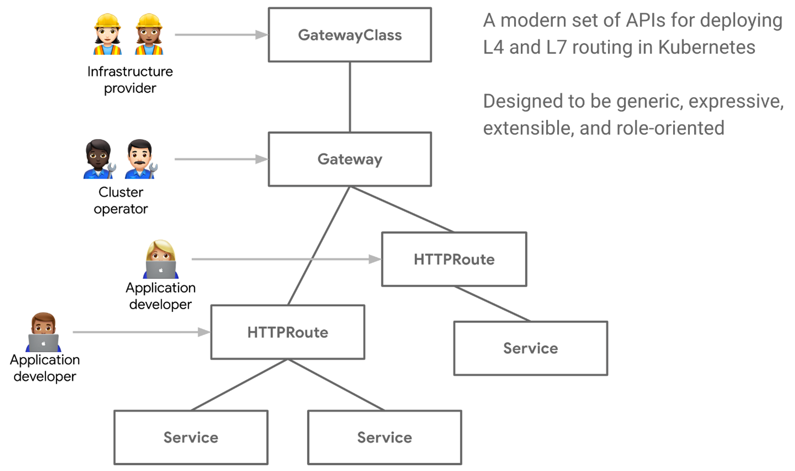

# k8s-gateway-api





1. Kubernetes doesn’t include Gateway API CRDs -> apigateway crd 생성 (https://gateway-api.sigs.k8s.io/guides/#install-standard-channel)
```shell
kubectl apply -f https://github.com/kubernetes-sigs/gateway-api/releases/download/v1.1.0/standard-install.yaml
```

2. Gateway API CRDs 설치 확인
istio, kuma 등 controller 설치하면 gatewayclass가 자동으로 생성됨 
```shell
k get GatewayClasses  -A       
NAME    CONTROLLER                    ACCEPTED   AGE
istio   istio.io/gateway-controller   True       50m
kuma    gateways.kuma.io/controller   True       50m
```
3. kuma-gw install
```shell
helm install kuma-gw ./kuma-gw 
```

4. kuma-gw가 설치되면 자동으로 pod, service 생성됨
```shell
k get pods -n kuma-demo                
NAME                                    READY   STATUS             RESTARTS        AGE
kuma-6c45b667b4-w6ttw                   1/1     Running            0               93m
```

```shell
k get service -n kuma-demo             
NAME                   TYPE           CLUSTER-IP       EXTERNAL-IP    PORT(S)        AGE
kuma                   LoadBalancer   10.102.106.203   34.64.63.247   80:30267/TCP   92m
```

5. gateway, httproute 랑 target service의 namespace가 다르면 referenceGrant 적용해야됨(./kuma-gw/templates/referenceGrant.yaml)

6. kuma에 curl로 확인 
```shell
curl 34.64.63.247   
{"Hello":"World"}%                                                            
```

